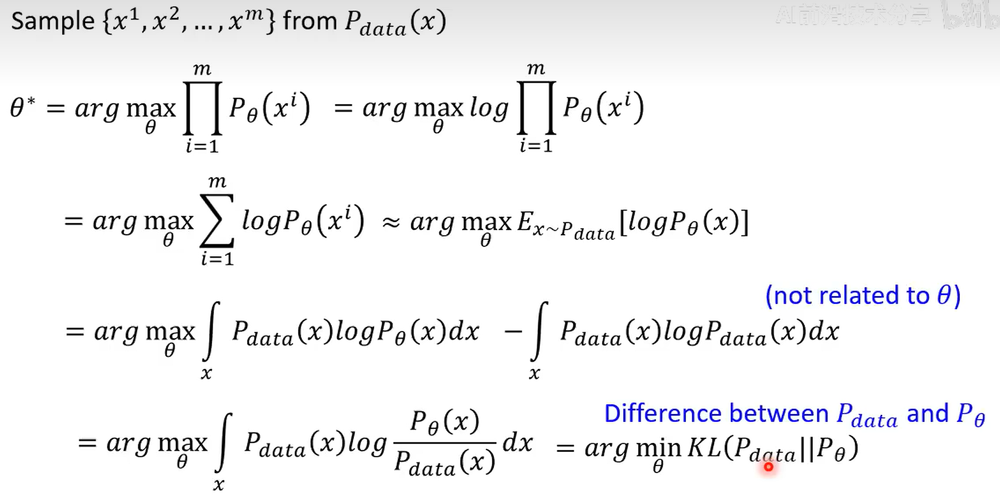
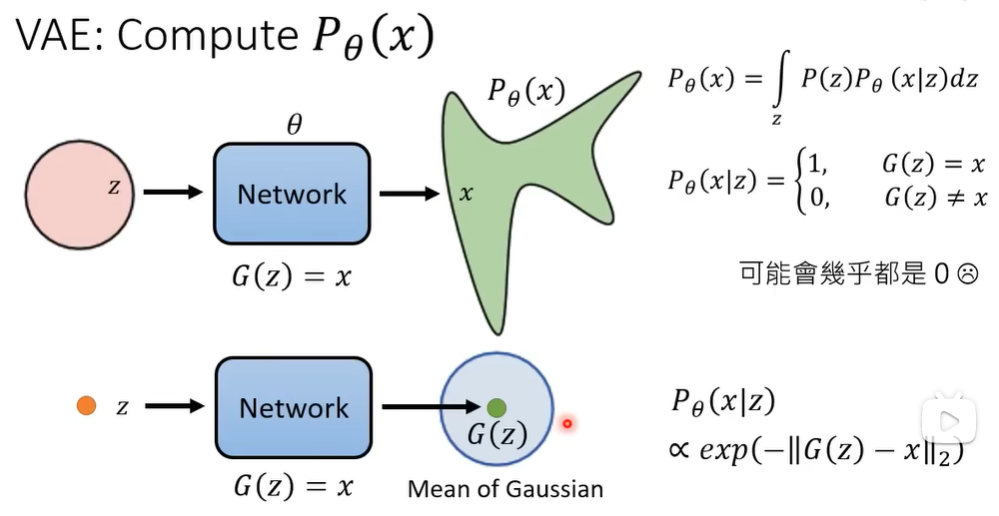
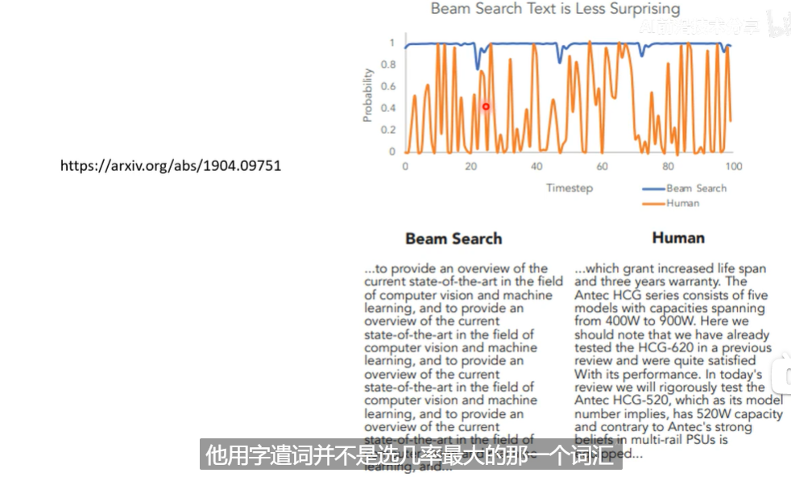

# DDPM

# DDPM Ⅰ
## diffusion model如何运作?
- sample一张杂讯图
- 放进去denoise模块
- 反复迭代，得到更清晰的图片
  - step xxx → step 1, *reverse process*

## denoise模块
- 反复应用同一个模块
  - 吃图片
  - 吃噪声严重程度（数字）
- Denoise内部
  - 

## 如何训练noise predictor?
- Forward/Diffusion process
  - 输入：杂讯图 and 噪声强度
  - 

## Text to Image?
有很多语言和图片成对出现的训练资料
- 此时增加一个文本输入即可
  - 

# DDPM Ⅱ
## text to image的framework

三者分开训练

## text encoder & generation model
结论：文字encoder大一点比较好, diffusion model没有太大影响

side note: 
- FID, 即feature-wise inception distance, 衡量两个Gaussian分布之间的差异
- CLIP, Contrastive Language-Image Pre-training, 衡量两个文本和图片之间的差异

## decoder
- 不需要文字资料训练
- 中间产物为 小图 $\rightarrow$ 原图
- 中间产物为 Latent Representation $\rightarrow$ 原图, auto-encoder

## 事实上的噪音添加

# diffusion model的数学原理Ⅰ
## VAE vs. DDPM
- VAE是“变分自编码器”（Variational Auto Encoder）的缩写, VAE模型包括编码器和解码器两个部分：编码器负责将输入数据压缩成一个潜在向量，解码器则从这个潜在向量重构原始数据
- Diffusion 的 noise 不需要learn

## 算法分析
- Training
  - 
  - 
    - 不是一点一点, 而是一次解决

- Inference
  - 

# diffusion model的数学原理Ⅱ
## 映像生成模型本质上的目标

加了文字相当于加了一个条件condition, 以下讨论忽略之
- MLE来衡量分布之间的差异
  - 
  - 找到$\theta^*$使得$p_{\theta}(x)$和$p_{data}(x)$之间的KL散度最小
  - 
    - side note: $\approx$ 成立是因为数据量很大?

## VAE的数学原理
- 
  - def $P_{\theta}(x|z)$ 
  - asm $G(Z)$ 是一个Gaussian分布的 $\mu$
  - side note: $f(x) = \frac{1}{\sqrt{2\pi}\sigma} e^{-\frac{(x-\mu)^2}{2\sigma^2}}$
- (注意$\theta$被省略了) 根据MLE, 需要使得 $logP_{\theta}(x)$ 大
  - 

## DDPM的数学原理
- 
- side note: 
  - $P_{\theta}(x_{t-1}|x_{t}) \propto exp(-||G(x_{t}) - x_{t-1}||_{2})$ 
  - $x_1:x_T$ 是从 $x_1$ 到 $x_T$ 的变量积分
  - $P_{\theta}(x)$ 和  $P(x)$ 区别! 有 $\theta$ 意味着通过 $\theta$ 求得
- 
- 计算 $q(x_t|x_{t-1})$ 
  - 递推和归纳法, 注意iid的Gaussian分布线性组合, 用相同方差和均值代替
  - 
- 回到 $P_{\theta}(x)$ 下界, 省略了 $\theta$ ?
- 
- 放大来看
- 由密度函数拆开来硬整, 
- 所以有
  - side note: 
    - $\bar \alpha_t$ 和 $\alpha_t$ 之间有乘法关系约束!注意前面的换元!
    - mean: 取决于 $x_t$ 和 $x_{0}$ , 符合直觉
- 回到优化目标
  - 有解析解, 但是注意到两个Gaussian分布的特点, 直接靠近mean即可
  - 
  - $G(x_t) \rightarrow LHS$, 注意到 $x_t = \sqrt{\bar \alpha_t}x_0 + \sqrt{1-\bar \alpha_t}\epsilon$, 并且没有用到 $x_{t-1}$
  - 
  - 需要learn的是 $\epsilon$ 
- 注意 $\alpha_t$ 序列没有深入探讨!

# diffusion model的数学原理Ⅲ
## 接上去DDPM的数学原理——为什么要加入随机性?
输出的不全是mean, 还叠加了 $\sigma_t \mathbf{z}$

可能的原因：
- 类比LLM 几率大 ≠ 效果好
- 类比语音合成的dropout形成sampling

## diffusion model的成功关键
### auto-regressive的思想

***non-auto-regressive + auto-regressive***
## 其他应用
- [语音合成](htttps://arxiv.org/abs/2009.00713)
- [Text](https://arxiv.org/abs/2205.14217)
  - Noise on latent space
  - mask-predict, 

