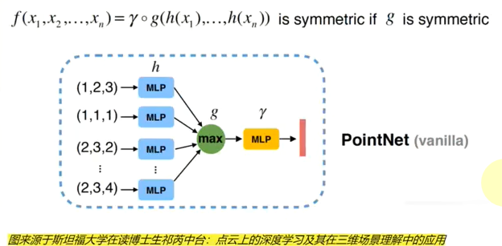
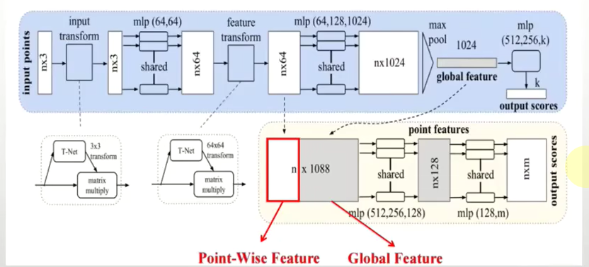
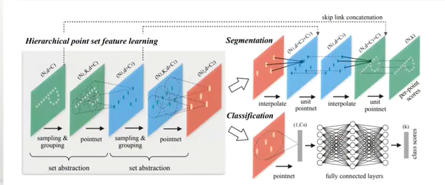
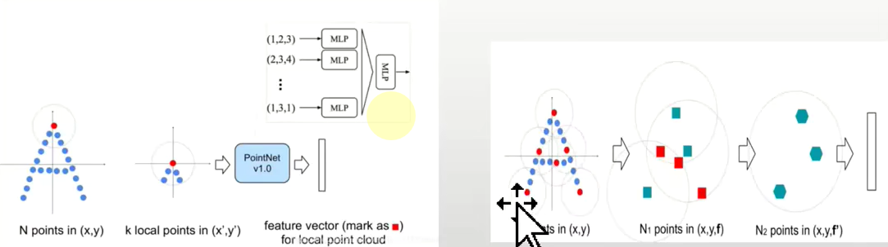
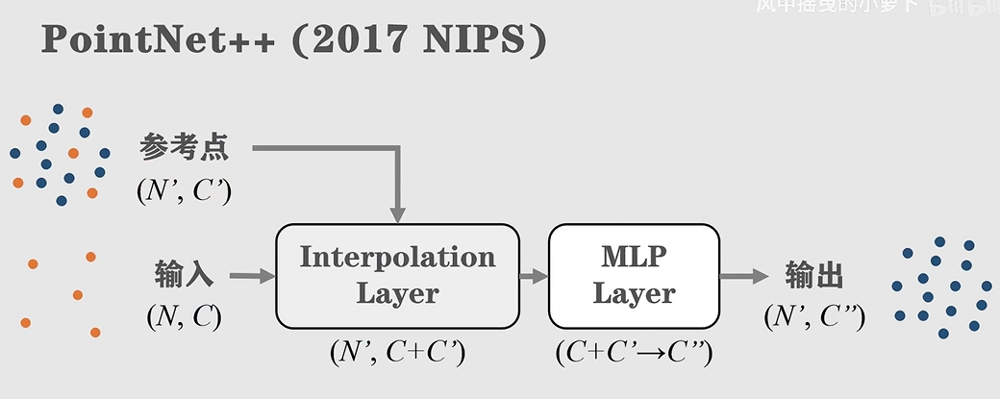

# Pointnet

# 点云的数据格式
一个点云是一个无序的向量集，每个点用三维坐标构成向量，其他信息可以扩展

有.xyz等格式

本质上是一个矩阵 $Num \times Dim$
# PointNet和++的算法具体操作
## PointNet算法的具体操作
- 必须考虑的几个特点
  - 旋转不变性，在仿射变换下点的排列不变
  - 置换不变性(无序的)：应该是对称函数，不考虑顺序
  - 局部结构需要考虑(分割时)，平衡global和local

1. 输入：点云数据
2. MLP升维，抽取特征
3. Max对称函数操作，降维，得到全局特征 $N \times 1$
4. 后续分类or分割 

1. 输入：点云数据
2. T-Net仿射变换（旋转）来保证旋转不变性
3. MLP升维，抽取特征
4. maxpooling操作，降维，得到global特征 $N \times 1$
5. 后续分类走mlp（fcnn）+softmax
6. 走分割的话拼接到feature $N\times 64$ 得到 $N\times 1088$，然后mlp给每个点属于哪几个类别打分

- 不足之处
  - maxpooling这一步直接把所有点池化为以一个全局特征，局部点与点的联系没有察觉 

## PointNet++算法的具体操作
借鉴了卷积神经网络的思想，对空间化整为零，分而治之

1. 进行多次set abstraction = sampling + grouping + PointNet
2. 走分类，同上PointNet处理
3. 走分割，interpolate插值，然后skip link concatenation拼接到低层次点特征后面，unit pointnet处理,重复几次，回到原始点云，得到分割结果（每个点的评分）

以下逐步分析
- set abstraction
  - sampling FPS取点
  - grouping 聚类ball query，
    - ball query采用`metric distance`和CNN曼哈顿距离不同，使得前者能泛化能力更好  
  - 然后采用pointnet对每个group进行特征提取
    - 提出针对 点 密度分布不均匀的 density adaptive PointNet
      - MSG，对不同大小的区域进行特征抽取并且拼在一起 `random input dropout`
      - MRG, “堆叠”多个PointNet高维抽取，改进：一个向量是抽取低一层的特征，另一个向量直接抽取底层特征，然后由点密度分布来决定按权重拼接

- interpolate & skip link concatenation （特征传播feature propagation）
  - 在低一层的坐标插入临近几个点的特征加权和，权重采用距离倒数
  - 和skip link 的点特征进行拼接
  - 过一层类似1 $\times$ 1的卷积`unit pointnet`

# 两篇的区别
1. 作用域：pointnet关注全局，++侧重关注局部然后才是全局
2. 点密度：pointnet关注点微小扰动、异常值的影响，++侧重点密度分布不均匀的影响
3. 层次：++提供的是一个架构，直觉上来讲比pointnet层次高一级，pointnet可以嵌入pointnet++，但也有其他编码方案可以嵌入++？

$By\ HZ$
